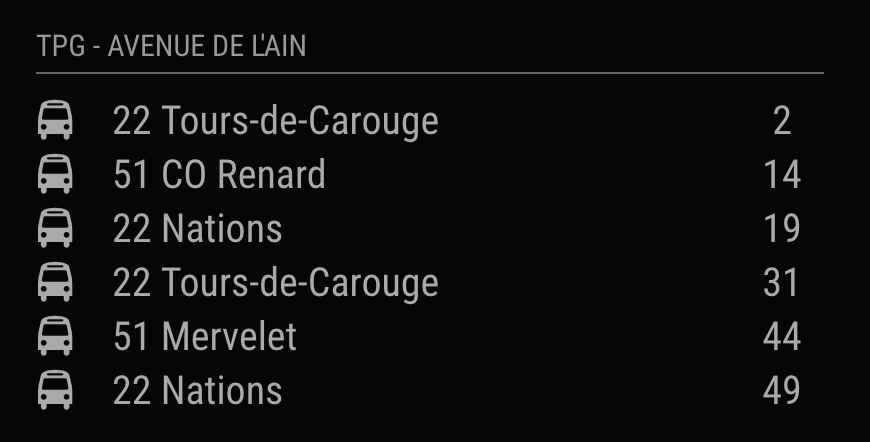

# MMM-tpg

MagicMirror² module - TPG (Transport Publics Genevois) station monitor

This module is an extension of [MagicMirror<sup>2</sup>](https://github.com/MichMich/MagicMirror) project by [MichMich](https://github.com/MichMich/)

## Screenshots



## Current version

v1.0.0

## Prerequisite

A working installation of [MagicMirror<sup>2</sup>](https://github.com/MichMich/MagicMirror)

## Installation

Navigate into your MagicMirror's modules folder and execute <br>
`git clone https://github.com/aluini/MMM-tpg.git`

## Configuration

Sample minimum configuration entry for your `~/MagicMirror/config/config.js`:

```
...

{
    module: 'tpg',
    position: 'top_left',
    header: 'TPG - NAMEOFTHESTOP',
    config: {
      params: {
        stopCode: '',            // Which stop would you like to have displayed?            
        key: ''  // Add your tpg opendata key
      }
    }
} // If this isn't your last module, add a comma after the bracket

...
```

Sample configuration entry for your `~/MagicMirror/config/config.js` with optional parameters:

```
...

{
    module: 'tpg',
    position: 'top_left',
    header: 'TPG - NAMEOFTHESTOP',
    config: {
      params: {
        stopCode: '',            // Which stop would you like to have displayed?            
        key: ''  // Add your tpg opendata key
      }
      updateInterval: 300000, // How often should the information be updated? (In milliseconds)
      maxDepartures: 10, // How many connections would you like to see?
    }
}

...
```

## Figuring out the correct stopCode

1. Open your web browser and navigate to the [<http://prod.ivtr-od.tpg.ch/v1/GetStops?key=xxxx]http://prod.ivtr-od.tpg.ch/v1/GetStops?key=xxxx>.
2. replace xxxx by your tpg opendata key
3. Copy the stopCode.
